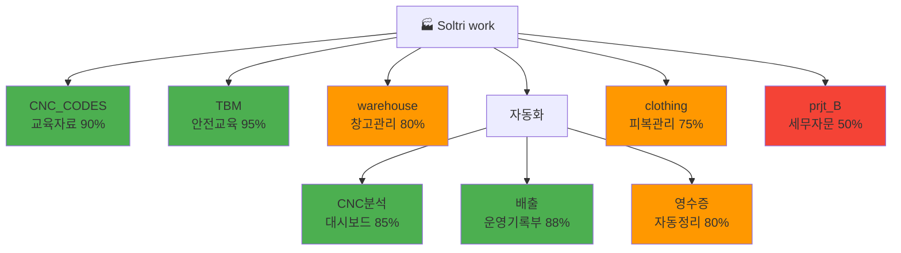
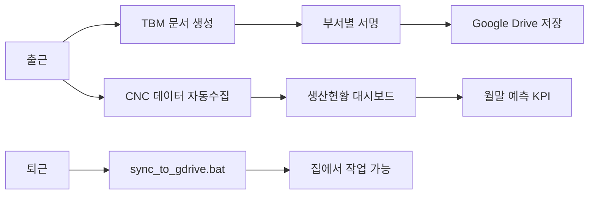

# Soltri 프로젝트 현황 다이어그램

## 프로젝트 구조

```mermaid
graph TD
    A[🏭 Soltri work] --> B[CNC_CODES<br/>교육자료 90%]
    A --> C[TBM<br/>안전교육 95%]
    A --> D[warehouse<br/>창고관리 80%]
    A --> E[자동화]
    A --> F[clothing<br/>피복관리 75%]
    A --> G[prjt_B<br/>세무자문 50%]

    E --> E1[CNC분석<br/>대시보드 85%]
    E --> E2[배출<br/>운영기록부 88%]
    E --> E3[영수증<br/>자동정리 80%]

    style B fill:#4CAF50
    style C fill:#4CAF50
    style D fill:#FF9800
    style E1 fill:#4CAF50
    style E2 fill:#4CAF50
    style E3 fill:#FF9800
    style F fill:#FF9800
    style G fill:#f44336
```

## 작업 흐름

```mermaid
flowchart LR
    아침[출근] --> TBM[TBM 문서 생성]
    아침 --> CNC[CNC 데이터 자동수집]
    TBM --> 서명[부서별 서명]
    CNC --> 대시보드[생산현황 대시보드]
    대시보드 --> 예측[월말 예측 KPI]
    서명 --> 드라이브[Google Drive 저장]
    퇴근 --> 동기화[sync_to_gdrive.bat]
    동기화 --> 집[집에서 작업 가능]
```
